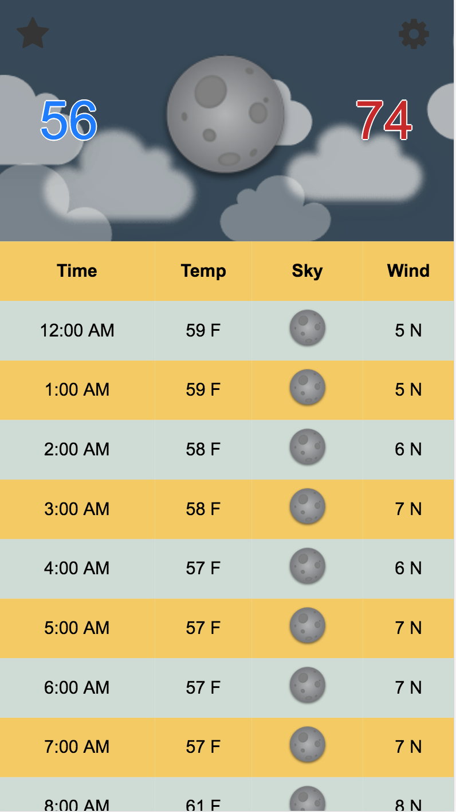
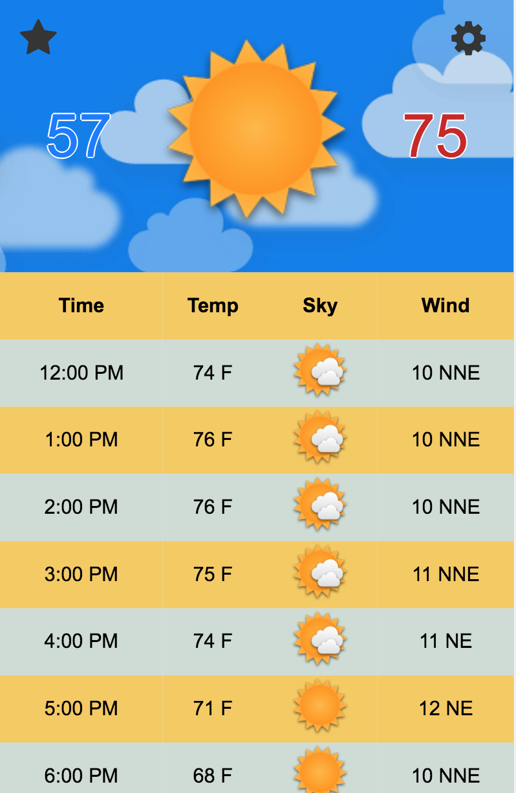

# topdown

version 1.3

## Synopsis

This project was created for a Project and Portfolio class at Full Sail Univerity. A weather application that is optimized for use on iPhone devices to show at a quick glance if there will be rain that day.

## Motivation

Wanting to take a quick glance at the weather and instantly know if I can ride my bike or drive my jeep.

## Installation

Open in Safari. Tap the **share** icon at the bottom of the screen. Then hit "Add to Home Screen".

## API Reference

+ Weather Underground API
+ Google Geocoding API
+ Google GeoLocation API
+ Google Map API

## Misc

[link to gitHub](https://github.com/MikeSewell/topdown-react)
